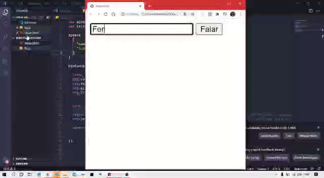

# text-to-speech
Este é um simples transformador de texto em voz, desenvolvido em JavaScript, feito com a SpeechSynthesis da Web Speech API. Todo o código está comentado e pode ser facilmente modificado.

